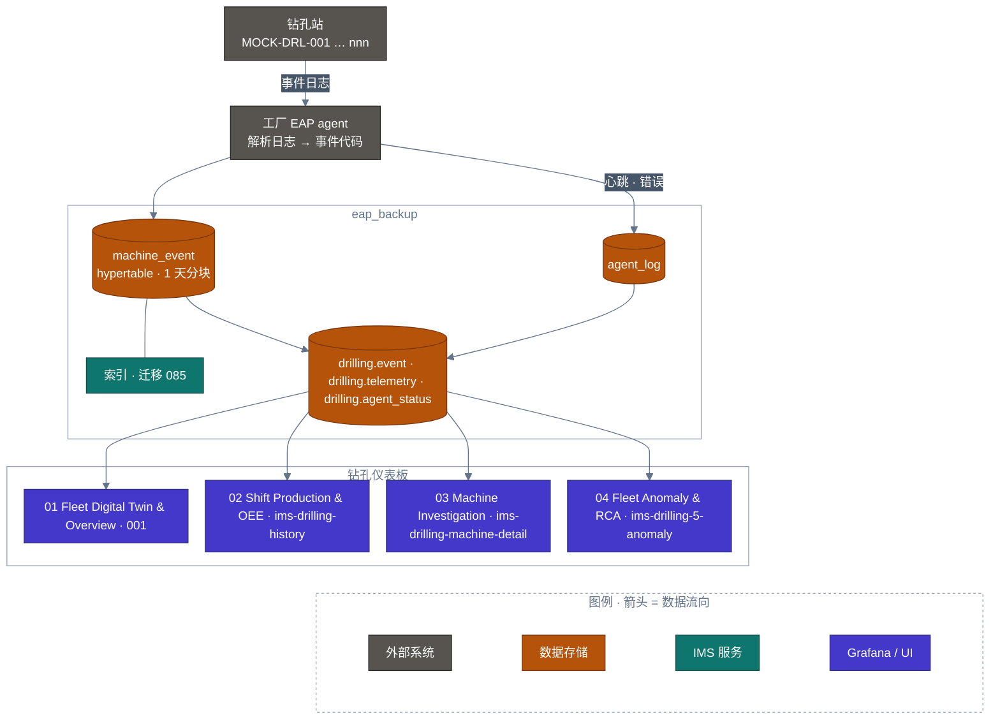
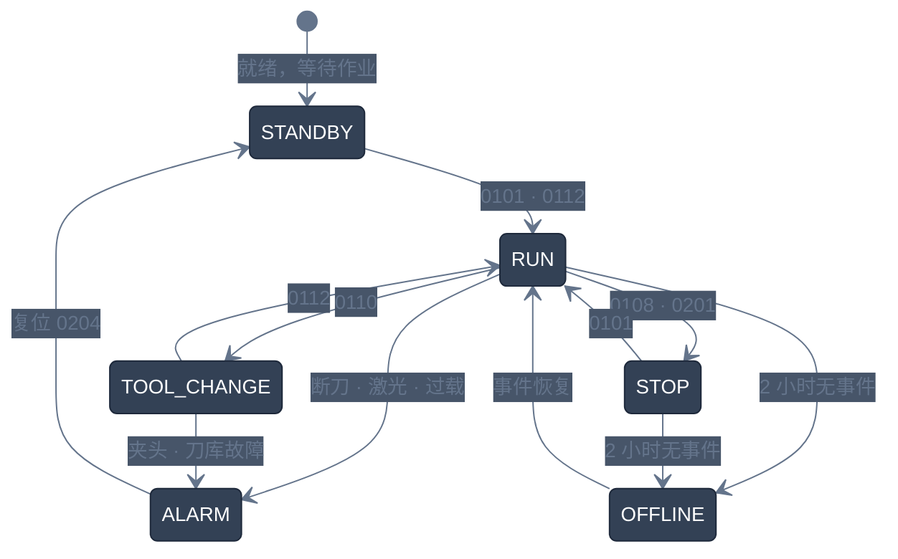
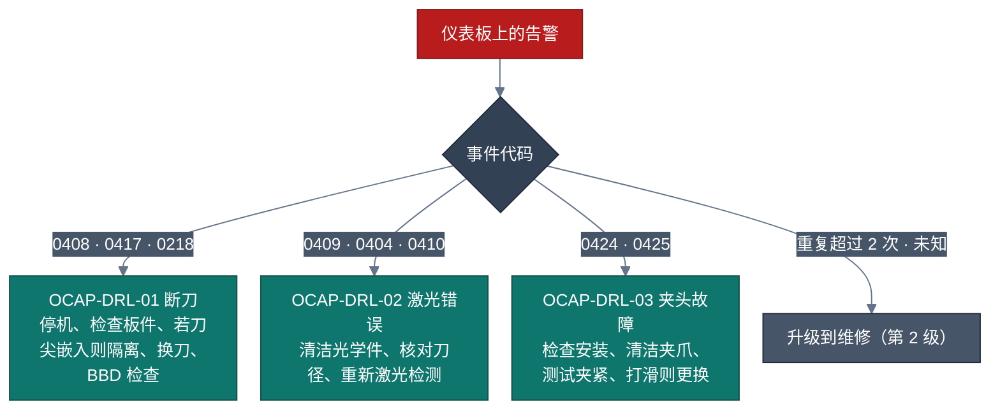
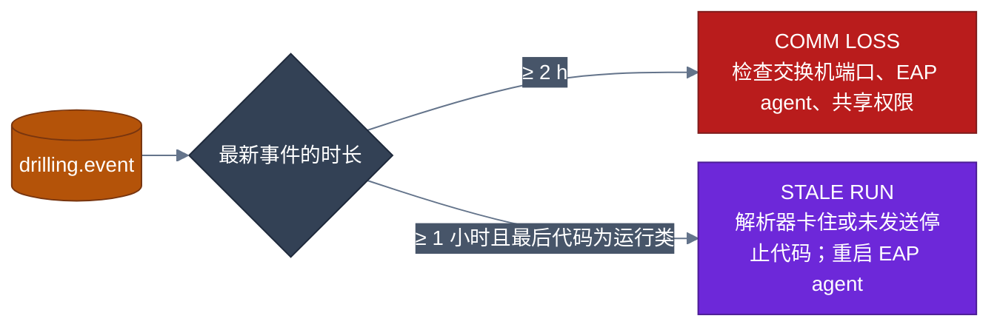

<!-- GLOBAL_NAV -->
<div align="right">
  <a href="../../README.md"> <b>首页</b></a> &nbsp;|&nbsp;
  <a href="../README.md"> <b>文档索引</b></a> &nbsp;|&nbsp;
  <a href="USER_MANUAL.md"> <b>用户手册</b></a>
</div>
<br/>

# IMS 数控钻孔运营与工程操作手册 (Drilling Operations Manual)

> **PCB 机械数控钻孔车间遥测监控与可靠性工程权威操作手册**  
> 涵盖 EAP 遥测管道架构、TimescaleDB 数据库模型、传感器信号解码引擎、4 大 Grafana 仪表板逐面板操作指南、失控响应处理方案 (OCAP) 以及 SRE 故障排除运行手册。

---

<div align="center">

 **文档编号:** IMS-MAN-DRL-001 &nbsp;|&nbsp;
 **版本:** 1.0 (生产就绪) &nbsp;|&nbsp;
 **密级:** 工厂内部标准 &nbsp;|&nbsp;
 **目标受众:** 机台操作员、机电维修技师、制程工程师、生产领班、SRE/IT 运维支持

</div>

---

## 目录 (Table of Contents)

1. [系统架构与数据摄取管道 (Architecture & Pipeline)](#1-系统架构与数据摄取管道-architecture--pipeline)
2. [遥测分类法与事件解码引擎 (Telemetry Taxonomy)](#2-遥测分类法与事件解码引擎-telemetry-taxonomy)
3. [4 大钻孔仪表板操作指南 (4-Dashboard Operational Guide)](#3-4-大钻孔仪表板操作指南-4-dashboard-operational-guide)
4. [标准操作规程与失控响应方案 (SOP & OCAP)](#4-标准操作规程与失控响应方案-sop--ocap)
5. [数据库运维与技术故障诊断 (Database Runbook & Diagnostics)](#5-数据库运维与技术故障诊断-database-runbook--diagnostics)

---

## 1. 系统架构与数据摄取管道 (Architecture & Pipeline)

PCB 机械数控钻孔（Mechanical CNC Drilling）是多层印刷电路板加工的关键首道工序。机群中的钻机（例如 `MOCK-DRL-001`），配备 6 个主轴，工作转速 **20,000 至 200,000 RPM**，进给速度达 2.5–3.0 m/min，钻头直径范围为 **0.15 mm 至 6.50 mm**。

遥测数据由机台本地 EAP 文件代理监听捕获，汇入独立的 TimescaleDB `eap_backup` 数据库中的超表（Hypertable）`public.machine_event`，并通过规范视图层 `drilling.*`（Migration 086）呈现在 Grafana 仪表板上。



---

## 2. 遥测分类法与事件解码引擎 (Telemetry Taxonomy)

### 2.1 机台状态机
系统将机台运行状态归纳为 6 种标准状态：
- **RUN**（绿色 `#22C55E`）：正在执行钻孔循环（`0112`, `0109`, `0101`）
- **ALARM**（红色 `#EF4444`）：发生故障停机（断刀、激光测量失败、过载等）
- **TOOL_CHANGE**（橙色 `#F59E0B`）：自动换刀机构动作中（`0110`）
- **STOP**（黄色 `#EAB308`）：加工完毕或手动停机（`0108`）
- **STANDBY**（青灰色 `#64748B`）：待机状态
- **OFFLINE**（深灰色 `#1E293B`）：超过 2 小时未接收到遥测数据（COMM LOSS）



### 2.2 主轴掩码计算 (Spindle 1–6 Bitmask)
机台通过代码 `0211`（`spindle ON: <mask>`）以二进制位掩码表示各主轴启用状态：
$$\text{Spindle } N \text{ Active} \iff (\text{Mask} \ \& \ 2^{N-1}) > 0$$
*(主轴 $N$ 启用当且仅当 $(\text{Mask} \ \& \ 2^{N-1}) > 0$)*
- **63** (`111111`): 全部 6 轴同时加工
- **31** (`011111`): 停用第 6 轴
- **0** (`000000`): 全轴停用



### 2.3 11 类标准根因归类
1. **断刀 / BBD 报警 (`bit_breakage`)**: `0408`, `0417`, `0120`, `0218`
2. **激光光学测量偏差 (`laser_measurement`)**: `0409`, `0404`, `0410`
3. **刀柄与夹头异常 (`shank_collet`)**: `0424`, `0425`, `0405`, `0411`
4. **钻头寿命到期 (`tool_life`)**: `0414`, `0119`
5. **主轴过载与过温 (`spindle_overload`)**: `0124`–`0128`
6. **冷却水与变频器故障 (`spindle_utility`)**: `0113`, `0114`
7. **主管路气压不足 (`air_low`)**: `0102`
8. **刀库定位错误 (`magazine`)**: `0406`
9. **安全锁销与模拟 (`safety_sim`)**: `05xx`, `06xx`, `07xx` (`0702`)
10. **伺服与机械轴极限 (`mech_depth`)**: `02xx`, `03xx`, `0103`–`0109`
11. **急停按钮触发 (`estop`)**: `0101` (ALARM/E)

---

## 3. 4 大钻孔仪表板操作指南 (4-Dashboard Operational Guide)

1. **Drilling — 01 Fleet Digital Twin & Overview (UID: `001`)**:
   - 展现全厂钻机实时卡片，包含 6 轴运行指示灯、当前刀具直径、转速进给、累计孔数。
   - 卡片标题为 `F<工厂> - <机器>`（例如 `FMOCK - MOCK-DRL-001`），工厂取自 `public.machine_master`；未登记的机器显示 `F?`。**Factory** 变量同时筛选卡片和 KPI 计数。
   - 提供状态一键过滤（`ALL`, `RUN`, `ALARM`, `TOOL_CHANGE`, `STOP`, `STANDBY`, `OFFLINE`）与程序名搜索。
   - 卡片条以 25 px/秒 匀速向左移动，到末端停 5 秒后回到起点，再停 3 秒重新开始。数据刷新（即使每 5 秒）不会让它跳动，页面重新加载后也保持原位置。指针停在卡片上时暂停，离开 2 秒后继续；用滚轮、滚动条、触摸或拖动手动移动后等待 6 秒；键盘焦点在卡片条内时暂停；切换状态过滤会从最左侧重新开始；操作系统开启“减少动态效果”时不自动移动。
2. **Drilling — 02 Shift Production & OEE Tracking (UID: `ims-drilling-history`)**:
   - 7 天滚动窗口班次生产看板，对比早班（08:00–20:00）与晚班（20:00–08:00）孔数及机台开动率（Availability Rate %）。
3. **Drilling — 03 Machine Investigation & Diagnostics (UID: `ims-drilling-machine-detail`)**:
   - 单台机深度排障控制台，包含当前机台卡片、事件类别柱状分布图、毫秒级事件时序流水账及报警事件记录。
4. **Drilling — 04 Fleet Anomaly & Root Cause Analysis (UID: `ims-drilling-5-anomaly`)**:
   - 钻孔机群可靠性工程分析看板，包含 4 项关键 KPI、11 类根因饼图、小时级堆叠趋势、前 15 大故障源机台排行及严重报警清单。

---

## 4. 标准操作规程与失控响应方案 (SOP & OCAP)

- **断刀响应 (OCAP-DRL-01)**: 出现 `0408` 时，机台立即暂停，操作员必须确认残断钻头是否嵌入 PCB 板中。嵌有残断钻头的板必须做隔离标记（Hold），严禁盲目复位启动造成二次撞刀。
- **激光测量偏差 (OCAP-DRL-02)**: 出现 `0409` 时，使用无尘拭镜纸与高纯度异丙醇清洁激光接收镜头，确认刀号规格。
- **主轴过温/变频器故障 (OCAP-DRL-05/06)**: 检查冷水机管路循环水流（须 $\ge 1.5\text{ L/min}$），红外测温机体不得高于 $45^\circ\text{C}$。
- **主气压下降 (OCAP-DRL-07)**: 压力表指示不得低于 $0.55\text{ MPa}$，全厂掉压立即联系厂务动力组。

---

## 5. 数据库运维与技术故障诊断 (Database Runbook & Diagnostics)



- **通讯丢失监控 (COMM LOSS)**: 超过 2 小时无新事件产生，机台标记为 OFFLINE，排查网络端口与 EAP 代理。
- **停滞监控 (STALE RUN)**: 机台保持 RUN 状态超过 60 分钟且孔数未递增，排查解析器锁死或机台未上报停机代码。
- **索引维护**:
  ```sql
  VACUUM ANALYZE public.machine_event;
  ```

---

<div align="center">
  <sub>IMS — 工业监控系统 · PCB 机械加工运营事业部</sub>
</div>
