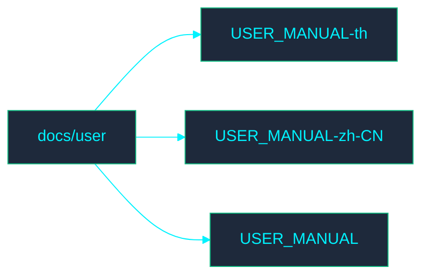

<!-- GLOBAL_NAV -->

  <a href="../../../README.md"> <b>Home</b></a> &nbsp;|&nbsp;
  <a href="../../../docs/README.md"> <b>Docs Index</b></a>

 

#  用户文档

欢迎来到 **User**（用户）目录。此部分包含与 IMS 用户流程相关的文档。

## ️ 目录结构图

##  文件索引

- [USER_MANUAL-th.md](../../../th/docs/user/USER_MANUAL.md)
- [USER_MANUAL-zh-CN.md](USER_MANUAL.md)
- [USER_MANUAL.md](../../../docs/user/USER_MANUAL.md)
